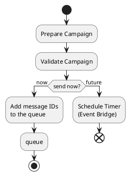

# Branching strategy and release management

## Using the trunk development method

```pikchr
scale = 0.8
fill = white
linewid *= 0.5
circle "C0" fit
circlerad = previous.radius
arrow
circle "C1"
arrow right 550%//until SC3.e
circle "C2" //at dist(C1, 0) heading 90 from C1
arrow
circle "C3"
arrow
circle "C4"
arrow
circle "C5"
C4P: circle "C1'" at dist(C0,C1) heading 30 from C4
arrow from C4 to C4P chop

Develop: box height C4P.y-C1.y \
    width (C5.e.x-C0.w.x)+(linewid) \
    with .w at 0.5*linewid west of C0.w \
    behind C0 \
    fill 0xc6e2ff thin color gray
Release_1_1_0: box same width Develop.e.x - C4.w.x \
    with .se at previous.ne \
    fill 0x9accfc
"Develop " rjust at Develop.w
"Release 1.1.0 " rjust at Release_1_1_0.w

SC1: circle "SC1" at dist(C0,C1) heading 150 from C1
arrow
circle "SC2"
arrow
circle "SC3"
arrow from C1 to SC1 chop
arrow from SC3 to C2 chop

circle "O" at dist(C0,C1)*2 heading 330 from C0
arrow from O to C0 chop


Story_1: box same width C2.w.x - C1.w.x \
    with .nw at (C1.s.x,-(dist(SC1,C1)/2)*0.88) \
    fill 0x9accfc
"Story 1 " rjust at Story_1.w

Main: box same width Develop.e.x+dist(C0,C1)*1.5 \
    with .sw at (Develop.w.x-dist(C0,C1),(dist(C0,C1)*1.3)) \
    fill 0x9accfc
"Main " rjust at Main.w
```

